# AI Team 用户手册

## 目录

- [产品简介](#产品简介)
- [教程：完成一次内部创新活动报名小程序任务](#教程完成一次内部创新活动报名小程序任务)
- [产品说明书](#产品说明书)

## 产品简介

AI Team 面向软件开发与交付团队，帮助开发人员把一个目标拆解为团队协作方案、员工职责和可跟踪的执行任务。你可以通过对话描述需求，检查并调整团队分工，再让团队或单个员工执行任务；执行过程中可查看节点状态、日志、人工待答问题和文件成果。AI Team 也提供员工工程编辑、评测调优以及看板预览。

一个 AI Team 聚合了目标和方案、员工工程、对话、任务及运行记录。新建 AI Team 只创建协作空间；还需要通过对话形成方案，再按需要创建任务。每次运行使用启动时确定的输入和团队配置，后续修改团队或员工不会改写已经开始的运行记录。

本手册先通过一个完整案例演示从目标到交付的主要操作，再按功能说明管理和维护 AI Team。

## 教程：完成一次内部创新活动报名小程序任务

本教程以“内部创新活动报名小程序”为例：先形成产品与研发分工，再提交团队任务，跟进执行过程并核对交付。运行状态和生成内容以当前任务详情为准。

### 1. 创建 AI Team

在 AI Team 首页选择“新建 AI Team”。输入名称 **内部创新活动报名小程序 AI Team**，选择“创建团队”。创建完成后，AI Team 会打开在“对话”页。

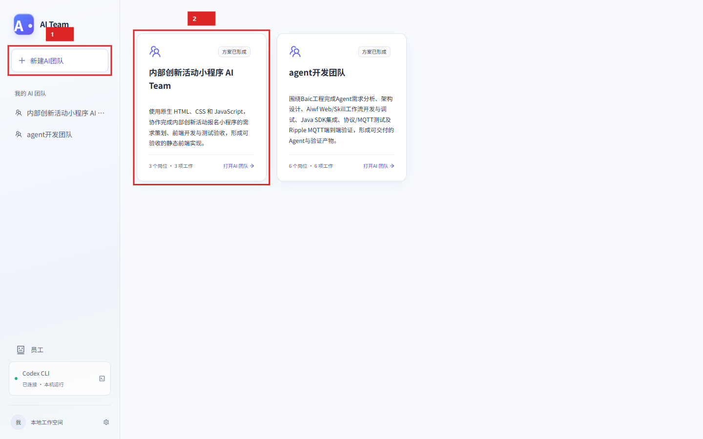

图 1：首页展示 AI Team 列表和新建入口。已有 AI Team 可从列表卡片打开。

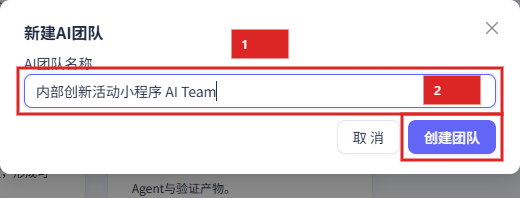

图 2：填写名称后创建 AI Team。

### 2. 描述目标并形成团队方案

在对话输入框中发送以下目标：

> 请为“内部创新活动报名小程序”创建一个 AI Team，包含需求策划、前端开发、测试验收三类员工。使用原生 HTML、CSS 和 JavaScript，明确每名员工的职责、输入、输出、依赖关系和验收标准。先形成团队方案，暂不执行任务。

按 Enter 发送；需要在同一条消息中换行时使用 Shift + Enter。等待 AI Team 回复方案。若方案缺少关键约束，可继续补充报名字段、权限范围或名额规则，再检查修订结果。附件和会话操作见[对话](#对话)。

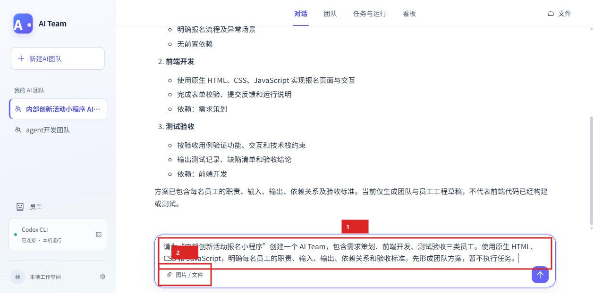

图 3：发送案例目标前，检查输入文本和可选附件。

方案形成后，阅读回复并核对团队目标、岗位职责、工作流和待确认问题。确认方案可用后继续；如果仍有歧义，直接在对话中要求 AI Team 修订，直到分工和验收要求符合预期。

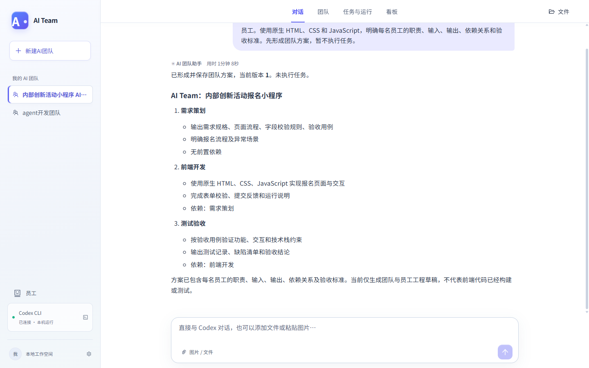

图 4：对照回复检查方案内容，再继续完善未确定的约束。

### 3. 检查协作流程和运行准备

切换到“团队”。在协作图中检查输入、员工节点、节点间交接和最终输出。选择“输入”查看任务接收的目标与资料范围；选择“输出”检查预期交付。选择员工节点可进入员工编辑器，检查岗位定义、职责和技能。

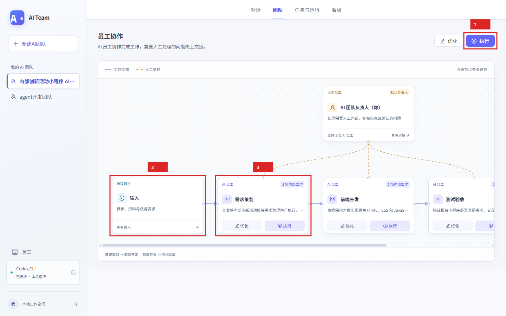

图 5：协作图用于检查员工分工、交接关系及团队输入和输出。

向下查看“运行准备”。阅读需要先补齐的依赖、可后续完善的依赖、待确认问题和当前假设。选择待确认问题可返回对话补充答复；必要时请 AI Team 更新方案，再回到协作图复查。

### 4. 按需检查或调整员工

选择需要调整的 AI 员工，进入员工编辑器。先在“岗位定义”中核对员工名称、岗位说明、职责和技能需求，再在“工程文件”中检查相关指令或配置。只修改本次任务需要调整的内容；完成后选择“保存修改”再返回团队页。离开时如有未保存修改，界面会要求确认。

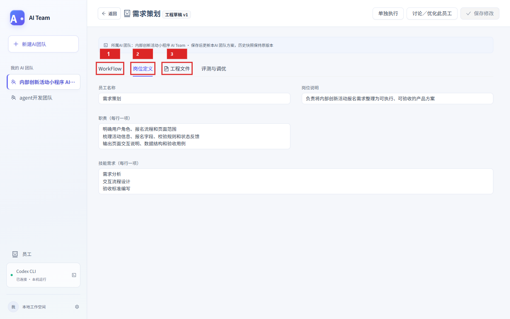

图 6：员工编辑器包含岗位定义、WorkFlow、工程文件和评测与调优等页签；本案例先核对岗位定义与工程文件。

WorkFlow 页签用于维护员工目标、输入输出契约和具体动作；评测与调优的使用方式见[员工库与员工工程](#员工库与员工工程)。

### 5. 创建团队执行任务

回到“团队”页，选择团队级“执行”以创建一项团队任务。执行范围选择“团队执行”。本次提交的工作要求为：

> 根据已形成的团队方案，完成内部创新活动报名小程序的需求文档、原生 HTML/CSS/JavaScript 页面和测试验收。前端必须实际生成并验证 index.html、style.css、app.js，可完成活动浏览、详情、报名表单与结果反馈；最终提供 README、测试报告及可查看的页面文件。每名员工提交前请核对交付文件确实存在、内容可读且符合验收要求。

需要参考现有材料时，添加输入文件；不需要时可以留空。提交前检查执行范围、工作要求和附件，再选择“开始执行”。任务抽屉和计划执行选项详见[新建和修改任务](#新建和修改任务)。

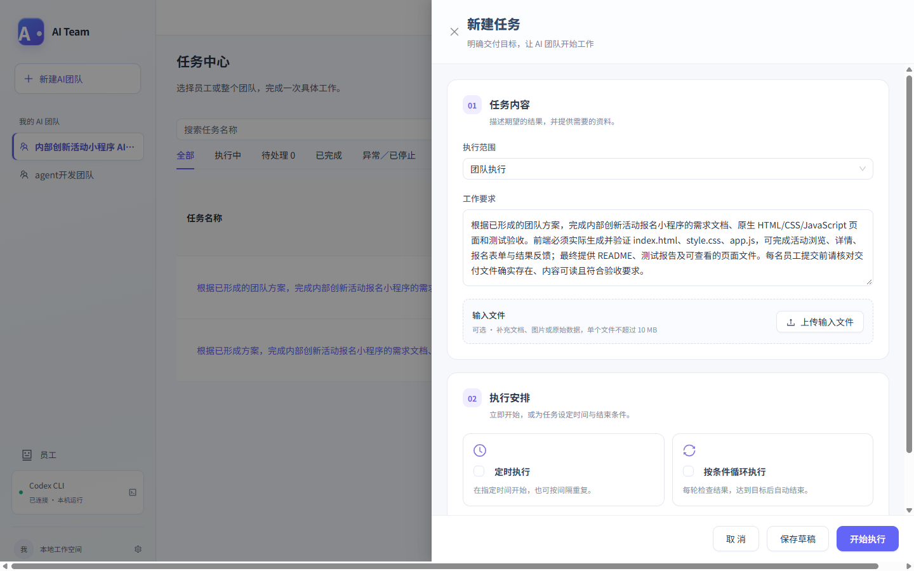

图 7：填写团队执行范围、工作要求和可选输入文件后开始执行。

### 6. 跟进运行并处理待答问题

打开任务对应的运行详情，沿执行工作流查看主节点和员工节点状态。需要了解某个节点时，打开其日志或员工详情；执行期间可按需停止运行。若员工提交了待确认问题，在“员工需要你处理”区域阅读问题、填写答复并提交；所有待答问题处理完后，选择“恢复执行”。

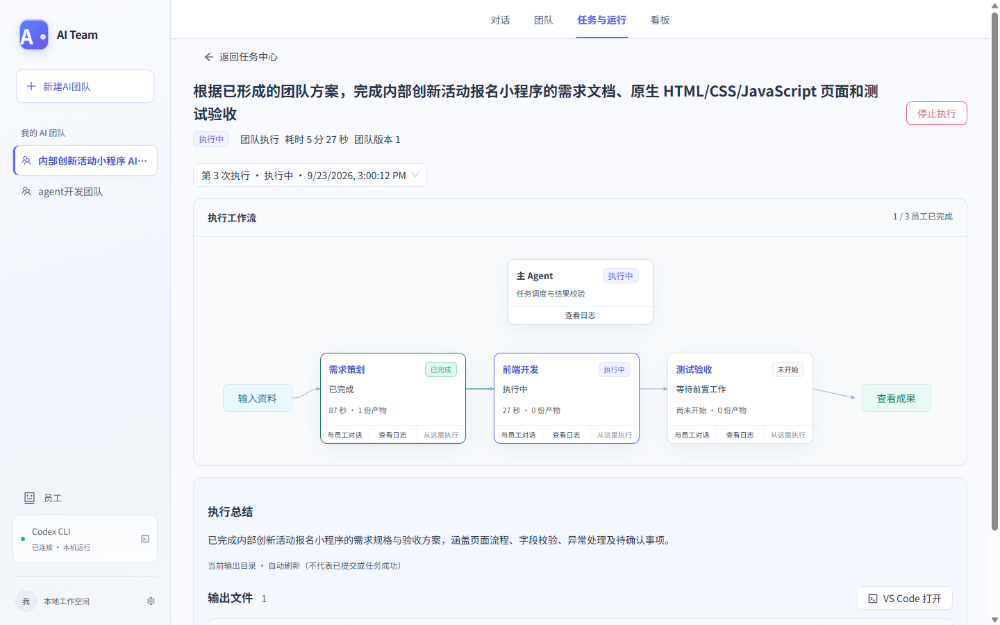

图 8：需求策划完成后，前端开发节点接续执行；执行工作流同步展示员工进度、产物数量和日志入口。

### 7. 检查输入、成果和交付文件

运行结束后，打开“输入资料”查看本次运行使用的文本和文件；打开“执行成果”检查运行总结、输出文件和验收记录。先确认执行工作流中三个员工均已完成，再逐项核对需求文档、`index.html`、`style.css`、`app.js`、`README.md` 和验收报告。任务显示“已完成”表示工作流结束，是否满足业务要求仍要看验收报告与实际文件。

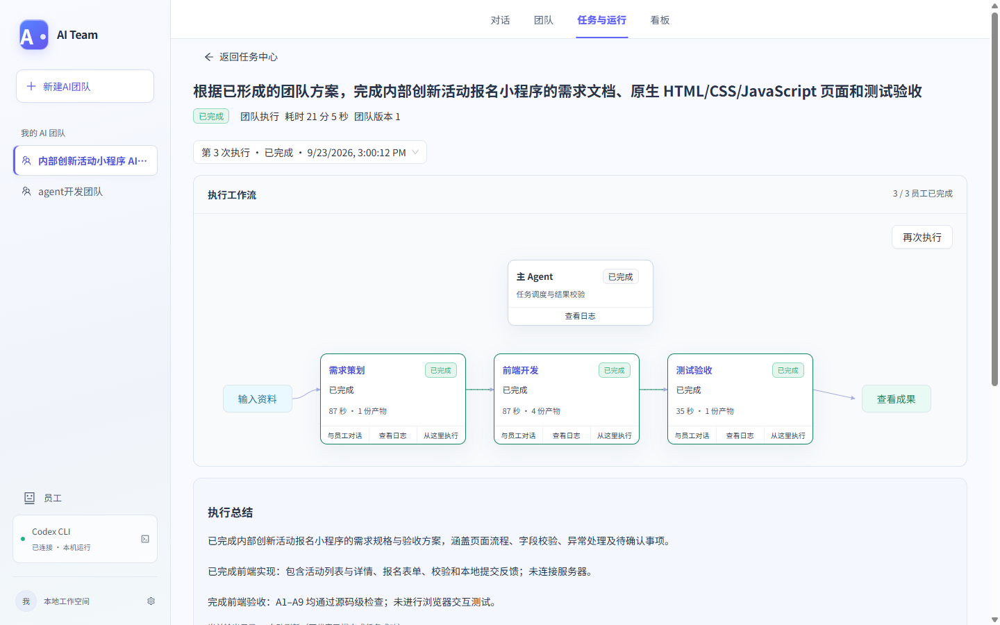

图 9：执行工作流显示 3/3 员工完成；下方执行总结概括交付及验证范围。

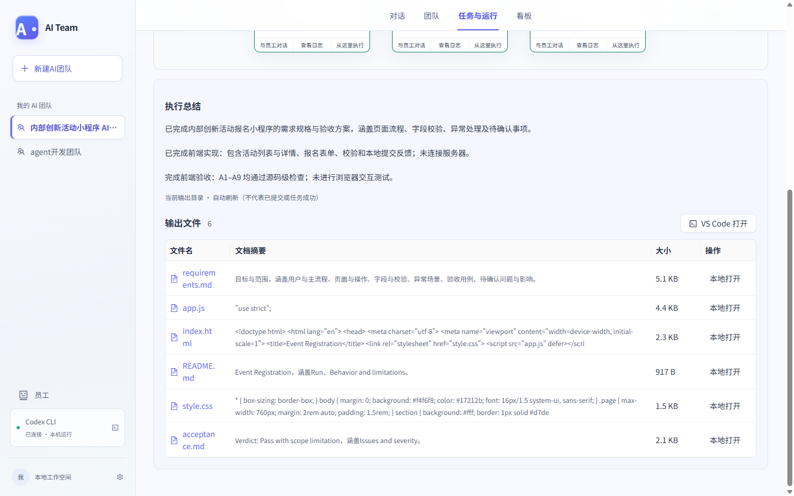

图 10：打开文件预览或下载后，与任务输入和验收用例逐项对照。本案例的验收报告注明通过的是源码级检查，不等同于页面交互测试。

若报告指出缺项或页面与需求不符，在执行图对应员工节点选择“从这里执行”，填写明确的修改要求。例如，要求前端补齐活动列表、详情、已关闭状态、报名字段及校验，并核对四个前端交付文件；AI Team 会从该节点及下游重新执行。之后重新查看验收报告。还应打开生成的页面文件，实际检查开放与关闭活动、无效联系方式提示和有效提交的本地反馈。若需要按原任务从头重新运行，选择“再次执行”，并决定沿用原配置还是使用最新团队配置。

### 8. 查看员工库

在侧栏选择“员工”，检查员工列表及所属 AI Team。需要继续维护时，选择员工卡片进入员工工程；员工库和编辑器的字段说明见[员工库与员工工程](#员工库与员工工程)。

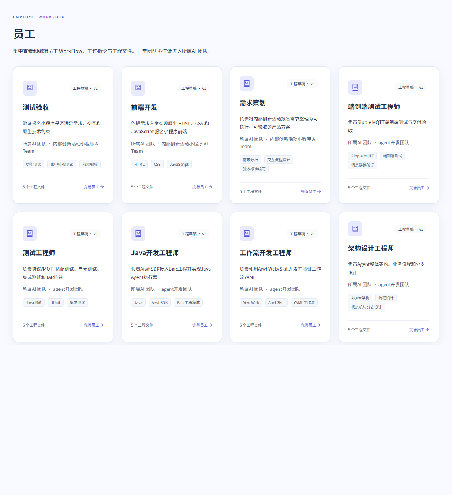

员工库汇总可访问的员工工程；选择卡片可再次打开对应员工。

### 9. 生成并查看看板

完成一次任务后切换到“看板”。首次进入时选择“生成团队看板”，在对话中提交看板目标，例如：

> 请为内部创新活动报名小程序生成团队看板。先调用 get_dashboard，按需求策划、前端开发和测试验收三个节点设计状态、产物数量与运行时间展示，并支持按节点筛选；通过 save_dashboard 保存独立版本。看板仅读取 window.DASHBOARD_DATA，样例与真实运行数据明确区分，不修改任务、规则、技能、员工文件或历史运行。

发送后等待 AI Team 确认看板版本已保存，再回到“看板”并选择“刷新”。在预览选择器中先查看配置预览，尝试用“按节点筛选”切换节点；如果当前版本提供对应运行快照，再选择该运行查看运行数据。界面提示“本次运行未绑定看板版本”时，说明该运行使用的配置没有看板版本，不能将配置预览当作它的历史结果。要让后续运行绑定看板，可新建任务；对旧任务选择“再次执行”时，勾选“使用团队最新配置”。看板入口和选择器的边界说明见[看板](#看板)。

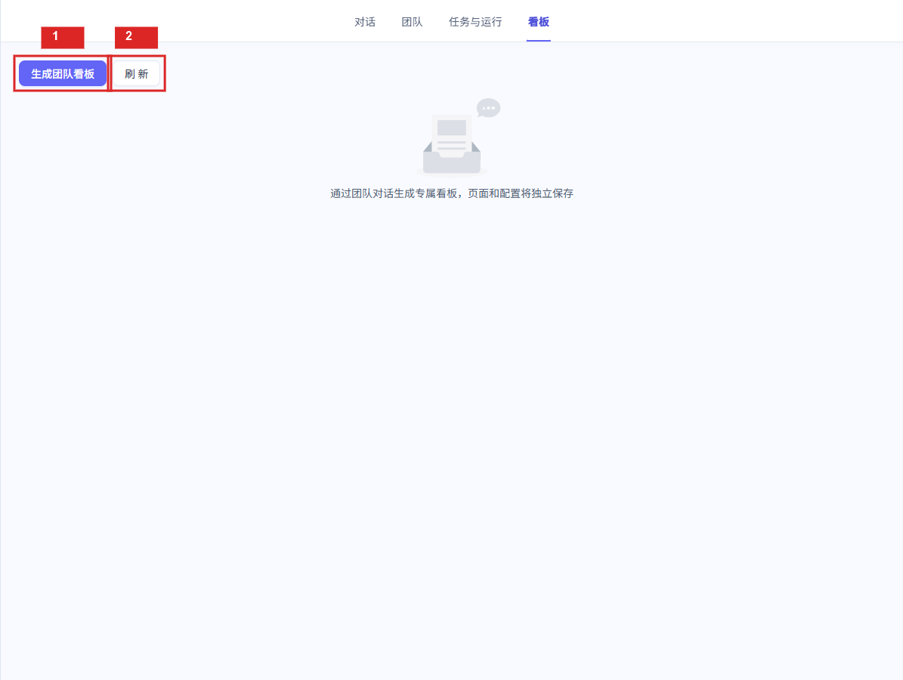

图 11：没有已保存看板时，从空状态发起生成；已有看板后，该区域会显示配置预览和运行数据选择器。

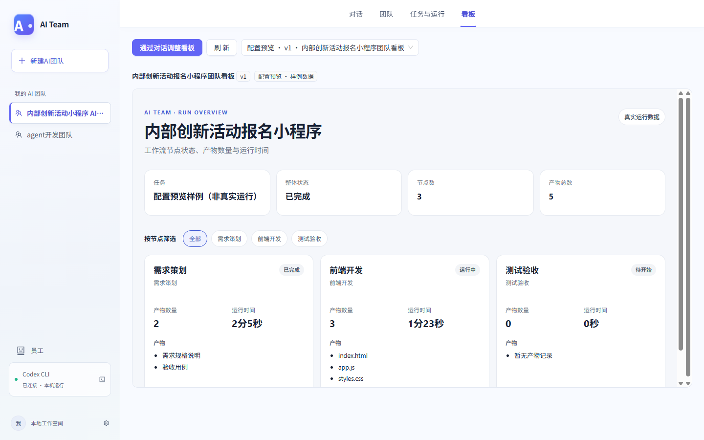

图 12：配置预览明确标注为样例数据。节点筛选可用于检查展示布局和交互，但样例数字不是本次任务的真实成果。

## 产品说明书

### 主界面与 AI Team 管理

AI Team 首页显示已创建的 AI Team、目标摘要、方案状态、岗位数和工作流数。选择卡片或侧栏条目可打开 AI Team。侧栏“新建 AI Team”用于创建名称和目标容器；团队目标与分工需再通过对话完善。

全局“员工”入口列出员工工程草稿版本、员工名称、岗位说明、所属 AI Team、技能标签和工程文件数。选择员工卡片可进入编辑器。

在侧栏 AI Team 条目上单击右键可重命名或删除。重命名后保存新名称；删除需在确认框中再次确认，运行中的 AI Team 不能删除。删除成功后，AI Team 从列表中移除，约 10 秒内可撤销；删除不代表立即清空本机保留的历史文件。

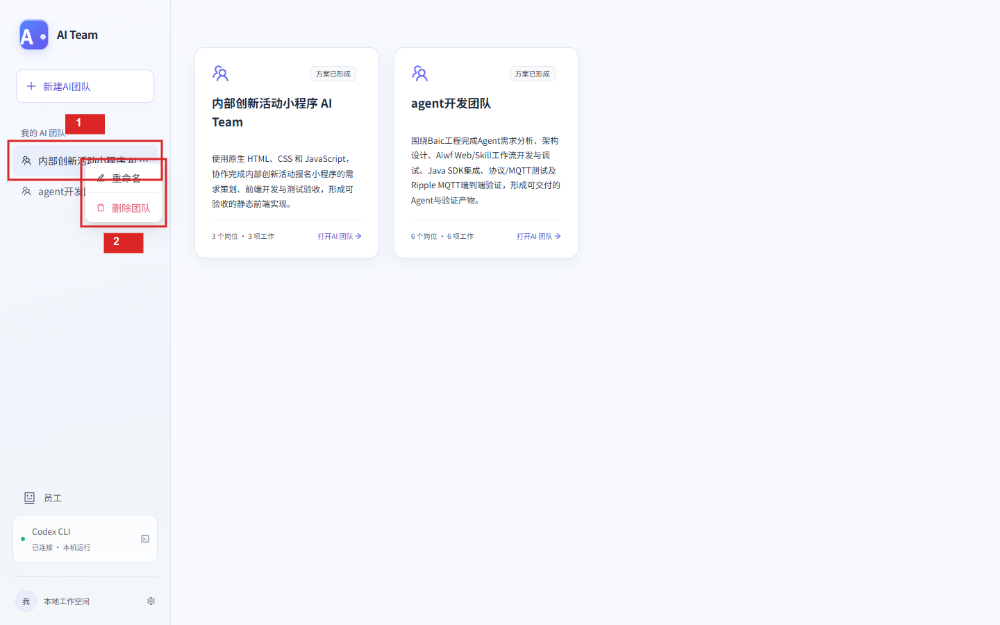

图 13：在侧栏 AI Team 条目上单击右键，可打开重命名和删除菜单。

### 对话

- 使用自然语言创建或修订团队目标、岗位分工、协作关系及运行准备要求。助手回复支持 Markdown 展示；生成期间可查看进度或停止当前轮。
- 空对话可选择场景建议。建议内容会填入输入框，检查后仍需发送。
- Enter 发送，Shift + Enter 换行。发送失败或中断时可根据界面提示重试；停止当前轮不会清除已有对话。
- “图片 / 文件”支持图片粘贴或选择附件。支持 PNG、JPEG/JPG、WebP、PDF、TXT、Markdown、CSV、JSON、ZIP、DOCX 和 XLSX；每个文件最大 5 MB，每条消息最多 4 个附件。发送前可移除附件。
- 从员工编辑器选择“讨论／优化此员工”可在对话中附带员工引用；可在发送前移除引用。运行中的员工会话会作为独立条目显示在对应 AI Team 下，可从侧栏重新打开。
- 对话页“文件”区域可浏览当前 AI Team 的工作空间；运行详情中的文件浏览限定于对应运行或节点。可导航目录、预览文本、下载文件；符合规则的团队规则文件可编辑并保存。

### 团队与运行准备

团队页以协作图显示从输入、员工协作到输出的路径。实线表示 AI 员工交接，虚线或曲线表示人工支持关系；图下方列出员工交接。选择输入、输出或员工节点可查看相应内容。团队级“执行”创建团队任务；员工节点的“执行”创建单员工任务；节点“优化”会把相应改进请求带入对话。

运行准备区域列出方案声明的依赖及其处理优先级、待确认问题和当前假设。选择依赖或问题可带入对话，讨论如何补齐或提交答复。方案中的自定义人工岗位可打开结构化方案编辑器，直接维护 JSON 草稿；保存时需通过岗位、工作流依赖和版本校验，未保存离开会要求确认。

### 员工库与员工工程

员工编辑器以全宽工作区显示员工名称、工程草稿版本和所属 AI Team。可通过页签维护不同部分：

- **岗位定义：** 编辑员工名称、岗位说明、职责和技能需求。
- **WorkFlow：** 查看和编辑员工目标、全局工作思路、依赖与约束、输入输出契约和具体动作。契约项包括名称、说明、类型或格式、必需性和校验标准。保存后开始的新任务使用更新后的 WorkFlow，已经开始的任务保留原配置。
- **工程文件：** 新增、编辑员工工程文件并保存；支持导出已保存的员工工程 ZIP。文件路径需为唯一的相对路径，不能使用 `employee.json`、隐藏目录、上级目录或反斜杠路径。
- **评测与调优：** 有实际输出的成功员工任务可作为评测案例。可选择案例开始基线评测，查看参考输出、本次输出、规则检查、差异和目标完成度；随后生成候选 WorkFlow 并对照评测。确认后采用候选会生成新的员工版本，不覆盖历史任务。开始评测前先保存员工修改。

从员工编辑器可选择“单独执行”进入单员工任务；选择“讨论／优化此员工”可返回对话继续调整。存在未保存修改时，离开编辑器需先处理保存或丢弃确认。

### 任务与运行

#### 任务列表与筛选

“任务与运行”页按任务汇总最近运行。可用名称搜索，按团队或单员工范围筛选，并按全部、执行中、待处理、已完成、异常/已停止查看。任务状态包括未开始、排队中、准备中、执行中、待处理、无需处理、待验收、已完成、执行失败、已中断和已停止。选择任务可打开运行详情。

#### 新建和修改任务

任务可由任务页“新建任务”、团队页“执行”或员工节点“执行”创建。选择团队执行或单员工执行；单员工任务需自行补充缺失的上游输入，不会自动运行其他员工。填写必需的“工作要求”，可添加输入文件（每个文件最大 10 MB）。

普通一次性任务可保存为草稿，也可立即开始。任务名称默认根据工作要求生成，创建后可在详情查看。创建自动任务时可设置未来首次执行时间、仅执行一次或按间隔重复；也可设置条件循环和停止条件。重复间隔可设为 1 至 525,600 分钟，最多执行 1 至 1,000 次。计划时间使用本机时区。异常、待人工处理或无法判断停止条件时，自动执行会暂停。

#### 运行详情、控制与重试

运行详情显示任务名称、状态、执行范围、耗时和启动时使用的团队版本。草稿可编辑或开始；执行中可停止；中断、停止、待处理或失败的运行在没有未答复问题时可恢复。结束后可再次执行，并选择沿用原配置或使用最新团队配置。自动任务可暂停或恢复；同一任务的多个执行批次可在批次选择器中查看。

执行工作流展示输入边界、主调度节点、员工节点、依赖连线和成果边界。选择员工节点可查看产物与验证摘要；也可打开员工对话或日志，或修改要求并从该节点重新执行。失败、中断或停止后，未完成节点可重试；先前尝试会保留在历史记录中。

#### 人工处理、输入和成果

进入待处理状态时，运行详情显示员工提交的问题和答复框。提交答复后，所有问题处理完成才可恢复运行。答复只作用于本次运行，不修改团队方案。

“输入资料”查看任务文本和输入文件；“执行成果”查看执行总结、输出文件和验收记录。输出文件可预览或下载；文件浏览器支持目录导航、刷新、文本预览和下载。主调度节点与员工节点分别提供日志，运行状态和日志会自动刷新。

#### 历史任务

若 AI Team 中存在旧式历史任务，任务列表会将其标为“历史”，并从历史任务抽屉打开。可查看该记录的输入、执行详情、日志和历史产物，并下载运行记录；此入口仅对已有历史任务显示。

### 看板

看板用于预览已保存的团队看板配置或与之关联的运行数据。无看板时，可从空状态发起生成请求；已有看板时，可通过对话请求调整。刷新可重新读取配置和运行列表。已保存配置的预览可展示节点状态、产物数量、运行时间及生成页面提供的筛选交互。

预览选择器用于切换配置预览和运行数据。没有该次运行对应的看板快照时，当前配置不能代表历史运行结果；旧任务再次执行若沿用原配置，仍可能不绑定新看板，需选择“使用团队最新配置”。看板用于展示，不用于修改任务或业务数据。

没有已保存看板时，可从空状态发起生成请求。

配置预览带有样例数据标记；历史运行未绑定看板版本时，界面不会将当前配置套用为该次运行的结果。
